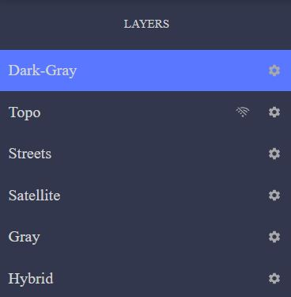
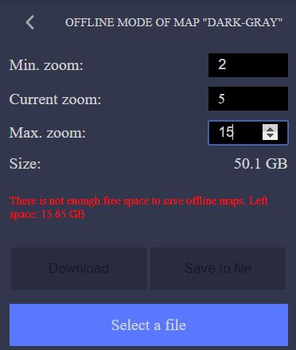
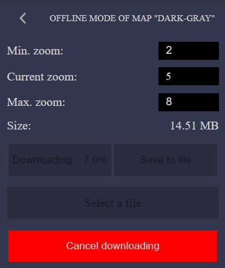
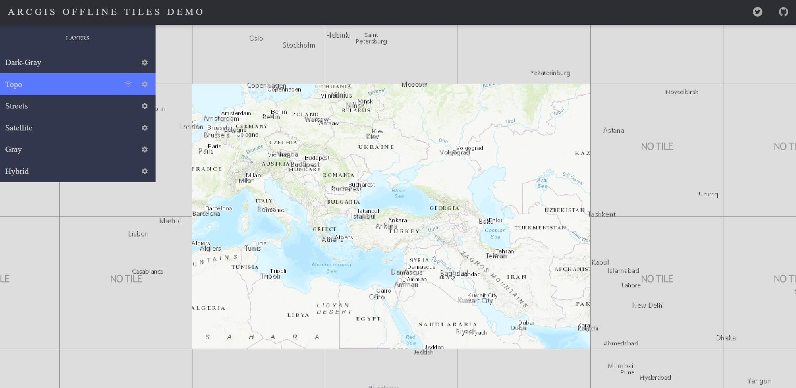

Arcgis Offline Tiles Demo Sources
=========================

This is a repo with sources for **[https://beslisbeth.github.io/arcgis-offline-tiles/]()** that  was created as an example of using the currently available functionality of `arcgis-offline-tiles`.

# Dependencies
Project includes dependencies on:
```
    "@arcgis/webpack-plugin": "4.11.0",
    "mobx": "^5.11.0",
    "mobx-react": "^6.1.1",
    "react": "^16.8.6",
    "react-dom": "^16.8.6"
    "webpack": "^4.35.2"
```
with all the needed plugins which are fully listed in [package.json](package.json)

# Workflow
1. Demo using basemaps from the online ArcGIS sources between which the user can switch.



2. A cogwheel icon opens a panel with offline settings for the layer. There are a set of options with minimal and maximum zoom that will be downloaded to the indexedDB.
When changing zoom level, it will show the warning if there is a smaller amount of free browser space, than needed.



3. Saving tiles is going on `Download` button which shows progress afterward. Any amount of tiles can be downloaded simultaneously. The progress will be  shown individually on
the relevant offline panel. Downloading can be stopped anytime by `Cancel downloading` button which appears after the process started.



4. When tiles are 100% downloaded to the indexedDB on the main Basemap Panel will appear `offline/online` button which can put basemap appropriately to offline or online mode.
5. Downloaded tiles can be saved to the file via `Save to file` button and transferred for example to another browser with not loaded tiles.
6. Tiles can be loaded from the file via `Load from file` button and choosing the needed .csv file and removed from the indexedDB via `Remove saved map`. 



# Licensing

This project is under MIT license. Any part of code from the demo page can be used and copied freely.